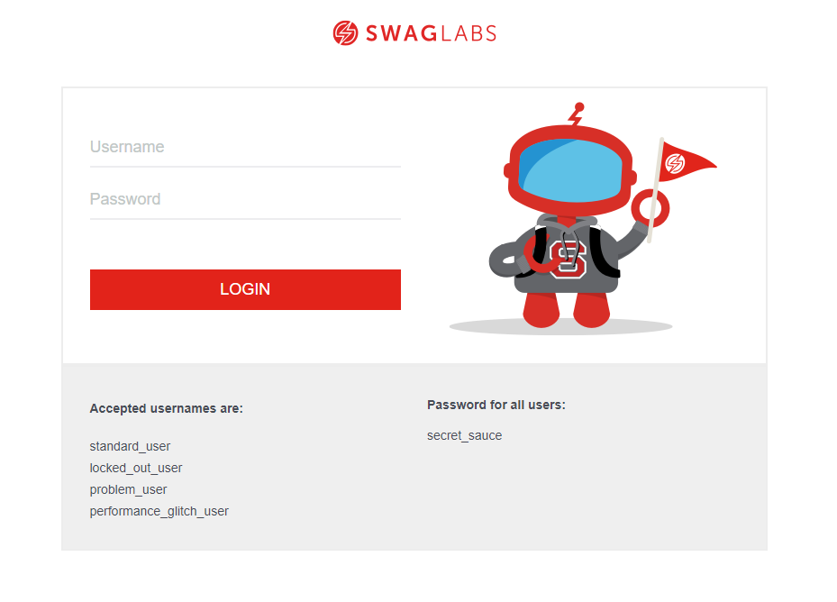

# Portfolio Quality Assurance

Repositório com objetivo de praticar habilidades relacionadas a levantamento de requisitos e criação de plano de teste. Para isso foram desenvolvidos dois projetos, sendo eles: 

## Análise de requisitos do PodsPot

Para esse projeto foi usado o protótipo de um aplicativo ficticio de podcast.

- Protótipo no Figma [Podcast App](https://www.figma.com/file/l0avfMrJDgQ3o7QBsE1zbA/PodcastAppChallenge?node-id=8%3A5945&t=AjGScm8WQr85i3Xq-1)

## Plano de teste do projeto Swag Labs

Para esse projeto foi usado o site [SwagLabs](https://www.saucedemo.com/). O SwagLabs é bastante utilizado na prática relacionada a testes e qualidade de software.

