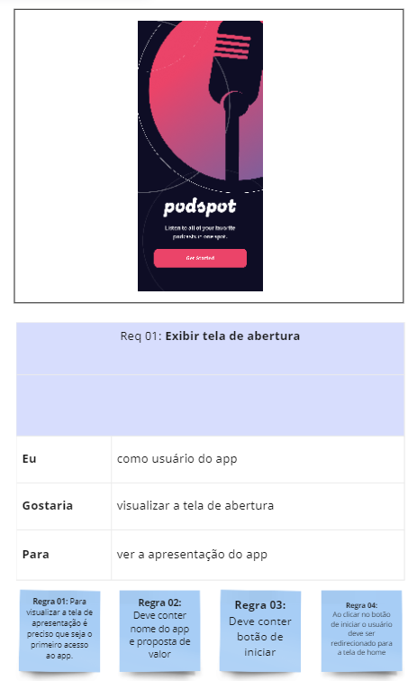

# PodsPot
Este projeto tem por objetivo colocar em prática conhecimentos adquiridos relacionados a levantamento de requisitos. Para o mesmo foi utilizado o protótipo de Figma de um app fictício de podcast, o [PodsPot](https://www.uplabs.com/posts/podcast-app-27e7dba2-b5d6-40f8-be0f-52d6710b9af7). O protótipo foi retirado do site [UpsLabs](https://www.uplabs.com/)

## Análise do projeto
A análise e levantamento de requisitos foram feitas utilizando o Miro, de acordo com o modelo abaixo

1. Protótipo a ser analisado.
2. Indicação do requerimento, com nome e número.
3. Descrição da funcionalidade, indicando quem deseja, o que se deseja e o porque da funcionalidade.
4. Regras de negócio.

### Referência da análise

<b> Req01: Exibir tela de abertura  </b>  

<b> Req01: Criar padrão de header  </b>  

<b> Req01: Exibir tela 'Top 10 podcasts'  </b>  

<b> Req04: Exibir categorias de podcast  </b>  

.png)
.png)

<b> Req05: Exibir lista de podcasts recomendados  </b>  

.png)
.png)

<b> Req06: Exibir tela inicial do podcast selecionado  </b>  

.png)
.png)

<b> Req07: Exibir lista de episódios  </b>  

.png)  
.png)

<b> Req08: Tela player  </b>  
.png)
.png)
