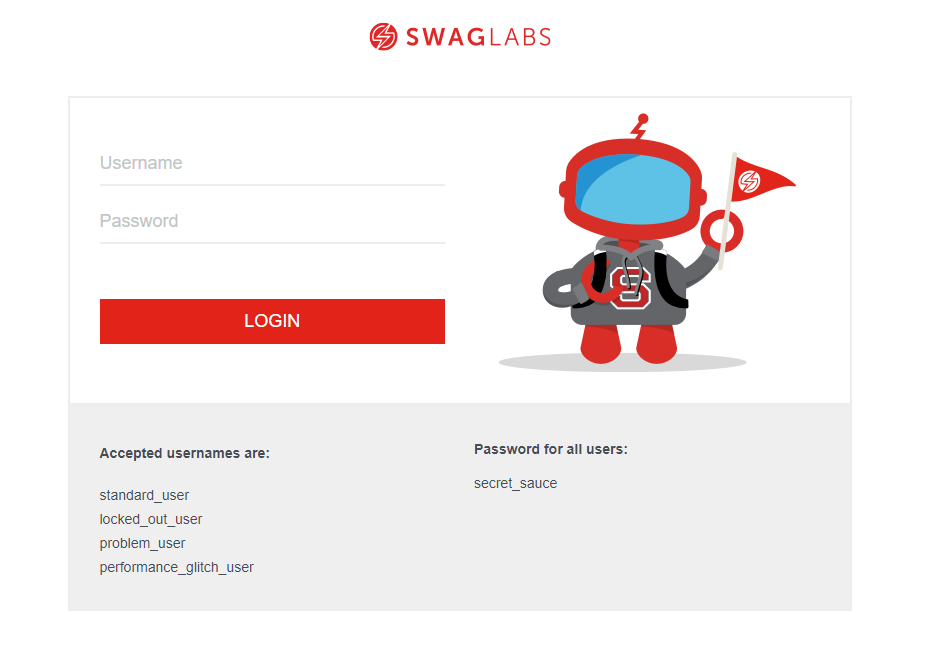
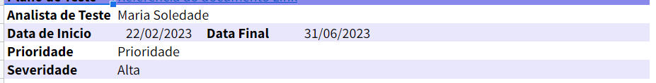
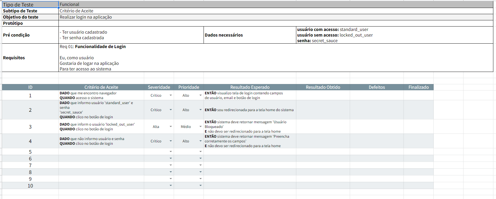
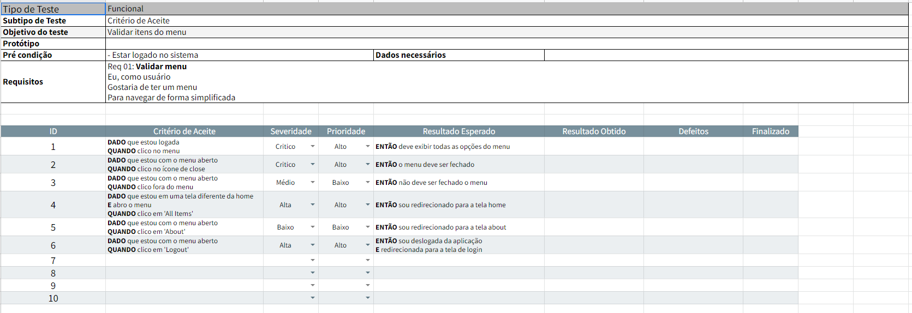
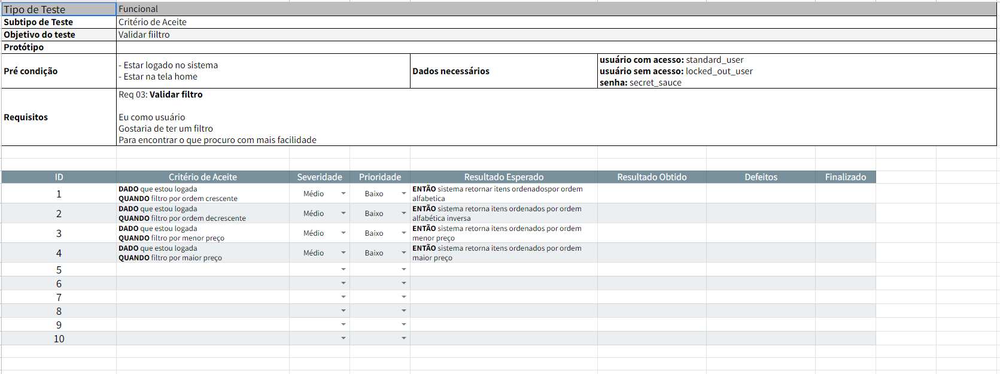
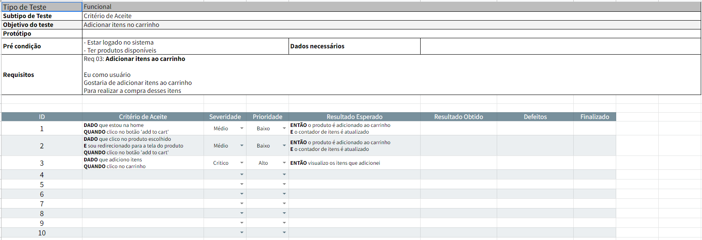
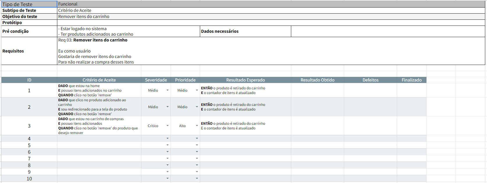
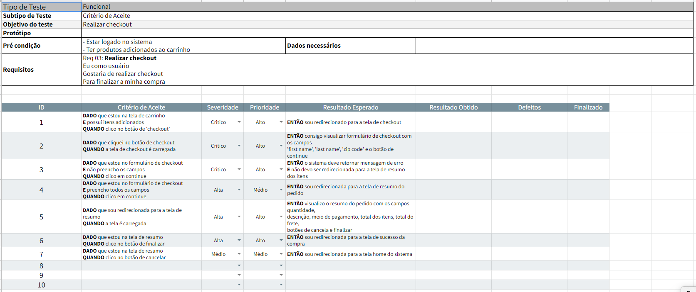

# Swag Labs Site
Este projeto tem por objetivo colocar em prática conhecimentos adquiridos relacionados a elaboração de um **plano de testes**. Para o mesmo foi utilizado o site [Swag Labs](https://www.saucedemo.com/).

## Ferramentas
- Site usado para elaboração do plano: [Swag Labs](https://www.saucedemo.com/).  

- Excel para a criação do plano

## Plano de teste
### Apresentação do Plano

### Suites de teste
Cada suíte de teste terá as seguintes informações:
- Objetivo do teste:
- Tempo de execução:
- Protótipo:
- Pré condicação:
- Dados necessário:
- Critério de aceite:
- Requisitos:
- Casos de teste:
- Prioridade:
- Severidade

### Suites desenvolvidas
**Login**

**Menu**

**Filtro**

**Add Itens ao Carrinho**

**Remover itens do carrinho**

**Checkout da compra**

